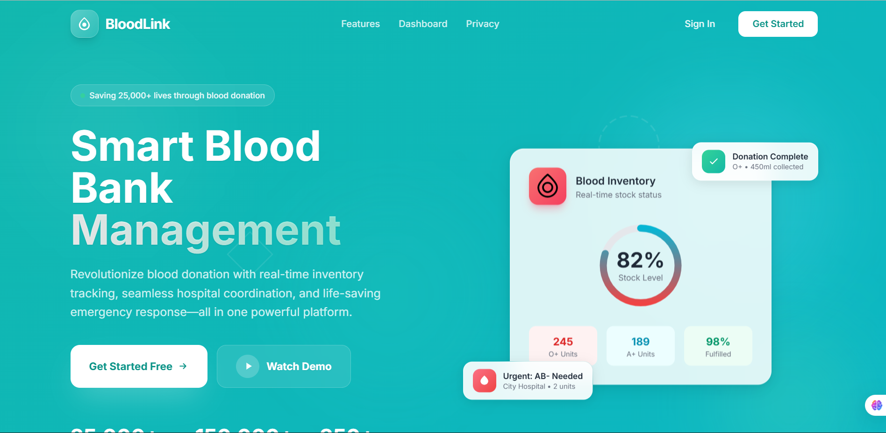
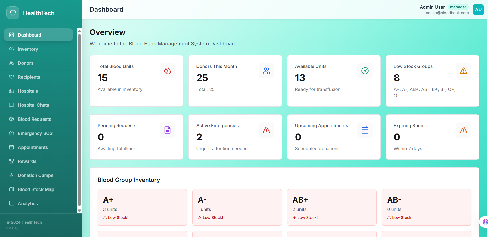
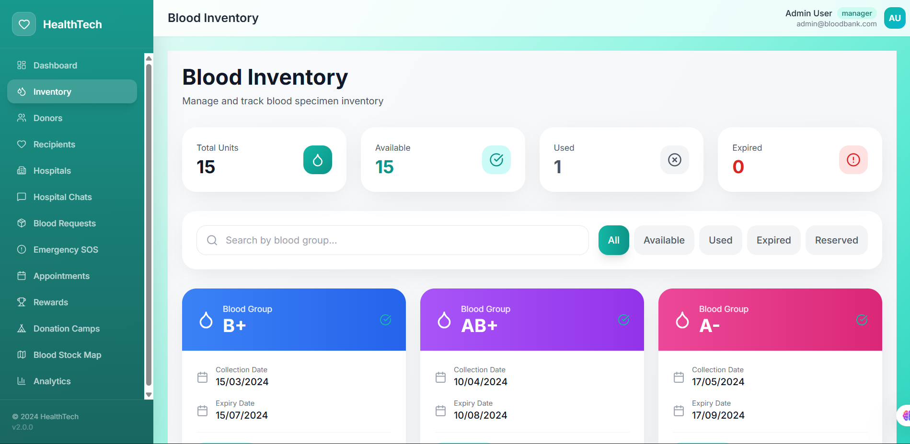
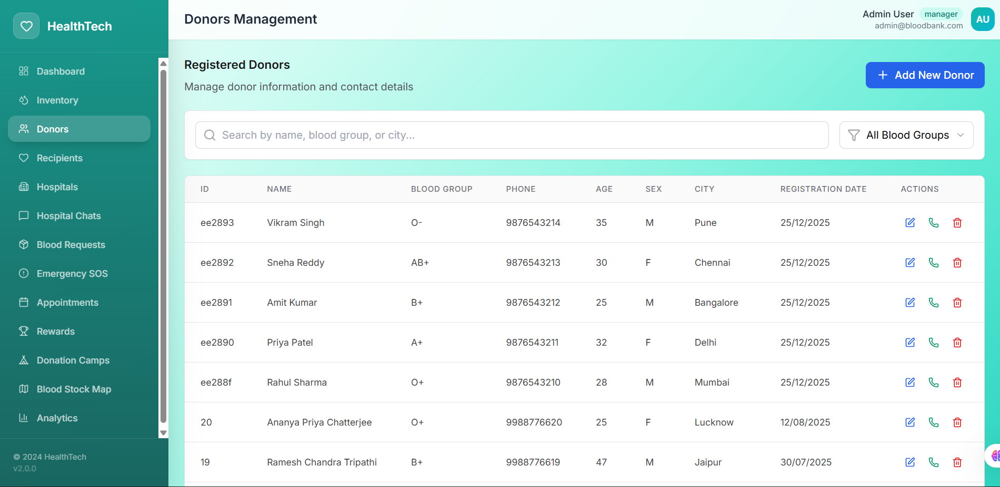
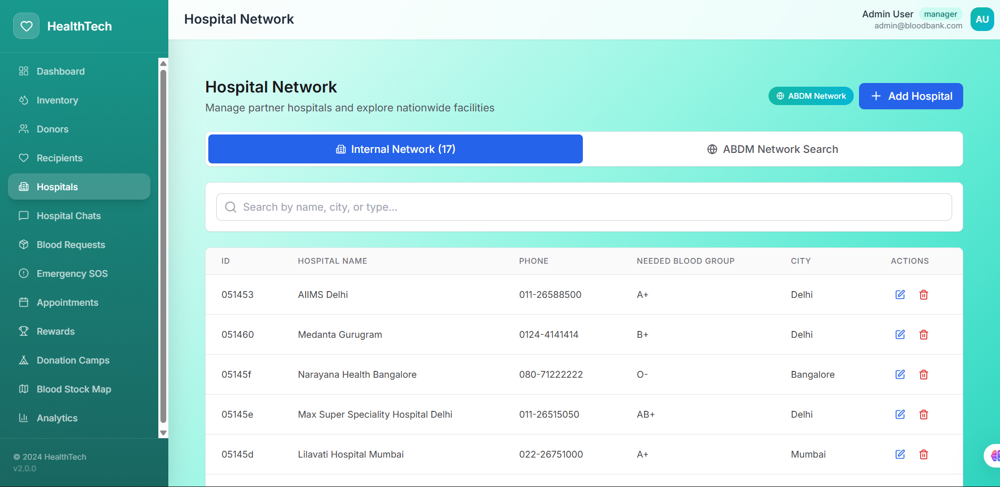

<div align="center">

  <h1>🩸 BloodLink 🩸</h1>
  <h3><em>Connecting lives through smart blood bank management.</em></h3>

</div>

<!-- Terminal Intro Animation -->
<div align="center">
  
</div>


## 🎯 Problem & Inspiration

<table>
<tr>
<td>

Every 2 seconds, someone needs blood, yet **38% of blood requests go unfulfilled** due to poor inventory management and lack of coordination between blood banks, donors, and hospitals. Traditional systems are fragmented, slow, and inefficient.

**BloodLink** bridges this gap by creating a unified, intelligent ecosystem that connects donors, blood banks, hospitals, and recipients in real-time — ensuring no life is lost due to blood unavailability.

</td>
<td width="40%">

</td>
</tr>
</table>


## 🧠 What It Does

<div align="center">
  <table>
    <tr>
      <td align="center"><h3>🩺</h3><h4>Smart Inventory Management</h4><p>Real-time blood stock tracking across all blood groups</p></td>
      <td align="center"><h3>🤝</h3><h4>Donor Management</h4><p>Complete registration and tracking system</p></td>
    </tr>
    <tr>
      <td align="center"><h3>🏥</h3><h4>Hospital Network</h4><p>Seamless coordination between blood banks and hospitals</p></td>
      <td align="center"><h3>📱</h3><h4>Emergency Requests</h4><p>Instant alerts for urgent blood requirements</p></td>
    </tr>
    <tr>
      <td align="center"><h3>📊</h3><h4>Analytics Dashboard</h4><p>Insights on donations, inventory, and trends</p></td>
      <td align="center"><h3>🎪</h3><h4>Blood Donation Camps</h4><p>Organize and manage donation drives</p></td>
    </tr>
    <tr>
      <td align="center"><h3>💬</h3><h4>Real-Time Chat</h4><p>Communication between admin and hospitals</p></td>
      <td align="center"><h3>🔔</h3><h4>Smart Notifications</h4><p>Automated alerts for expiry, low stock & matches</p></td>
    </tr>
    <tr>
      <td align="center"><h3>🔐</h3><h4>Multi-Role Access</h4><p>Secure role-based authentication for all users</p></td>
      <td align="center"><h3>🗺️</h3><h4>ABDM Network Integration</h4><p>Access nearby blood bank facilities</p></td>
    </tr>
  </table>
</div>


## ⚙️ Tech Stack

<div align="center">

### Frontend
⚛️ React 18 • 🎨 Tailwind CSS • 🧭 React Router • 🔄 Context API • 📡 Axios  
🌍 i18next • 📱 PWA Support • 🎯 Responsive Design

### Backend
🟢 Node.js • 🚂 Express.js • 🍃 MongoDB • 🔒 JWT Authentication  
🛂 Passport.js • 🔐 bcryptjs • ⚡ RESTful APIs

### Features & Integrations
📊 Real-Time Analytics • 💾 Session Management • 🔔 Push Notifications  
🗺️ City-Based Filtering • 📦 Inventory Automation • 🎪 Camp Management

</div>


## 🎓 Target Users

- 🏥 **Blood Bank Administrators** – Comprehensive management of inventory, donors, recipients, and hospital network  
- 🩸 **Hospital Managers** – Submit blood requests, track inventory, and communicate with blood banks  
- 👨‍⚕️ **Healthcare Staff** – Recording donations, managing camps, and processing requests  
- 🚨 **Emergency Services** – Instant access to blood availability during critical situations  
- 📊 **Healthcare Analysts** – Access to analytics and reporting for data-driven decisions


## 🏗️ How We Built It

<table>
<tr>
<td>

BloodLink is architected as a comprehensive full-stack solution:

### Architecture
- 🎨 **React Frontend**: Component-based UI with reusable elements
- ⚡ **Express Backend**: RESTful API with modular controllers
- 🗄️ **MongoDB Database**: Flexible NoSQL for complex relationships
- 🔐 **JWT Auth**: Secure token-based authentication
- 🎭 **Role-Based Access**: Manager, Staff, Hospital, Donor roles

### Key Features
- **Smart Matching**: Auto-match blood requests with inventory
- **Expiry Management**: Automated tracking and alerts
- **Real-Time Updates**: Live inventory synchronization
- **Data Validation**: Comprehensive input validation
- **Error Handling**: Graceful error management
- **Scalable Design**: Microservices-ready architecture

</td>
<td width="40%">

</td>
</tr>
</table>


## ✨ Core Features

### 🩺 Blood Inventory Management
- Real-time tracking of blood units across all groups (A+, A-, B+, B-, AB+, AB-, O+, O-)
- Status management (Available, Reserved, Used, Contaminated)
- Automated expiry date monitoring
- Low stock alerts and notifications
- QR code generation for blood specimens

### 🤝 Donor Management
- Complete donor registration with validation
- Donation history tracking
- Eligibility checks (age, health status)
- Automated notifications for eligible donors
- Comprehensive donor database

### 🏥 Hospital Network
- Hospital registration and authentication
- Real-time inventory access
- Blood request submission
- Request approval workflow
- Hospital-specific inventory tracking

### 📊 Analytics & Reporting
- Dashboard with key metrics
- Blood group distribution charts
- Donation trends analysis
- Monthly/yearly statistics
- Export reports (PDF/Excel)

### 🎪 Blood Donation Camps
- Camp creation and management
- Volunteer coordination
- Location mapping
- Registration tracking
- Success metrics

###  Emergency Requests
- Priority request handling
- Instant notifications to donors
- Multi-hospital coordination
- Real-time status tracking
- Emergency contact alerts

### 💬 Communication Hub
- In-app chat system
- Hospital-admin messaging
- Broadcast notifications
- Request status updates
- Real-time communication


## 📂 Project Structure

```
BloodLink/
├── 📱 blood-bank-app/              # React Frontend
│   ├── src/
│   │   ├── components/            # Reusable UI components
│   │   ├── pages/                 # Page components
│   │   ├── context/               # React Context for state
│   │   ├── services/              # API services
│   │   └── data/                  # Mock data & constants
│   └── public/                    # Static assets
│
├── 🔧 blood-bank-backend/         # Node.js API
│   ├── controllers/               # Business logic
│   ├── models/                    # MongoDB schemas
│   ├── routes/                    # API endpoints
│   ├── middleware/                # Auth & validation
│   └── config/                    # Database & Passport
│
└── 🐍 blood-stock-finder/         # Python utility
    └── blood_stock_finder.py      # Stock finder script
```


## 🚀 Quick Start Guide

### Prerequisites
```bash
Node.js v14+
MongoDB (local or Atlas)
npm or yarn
```

### 1️⃣ Clone the Repository
```bash
git clone <your-repo-url>
cd Healthtech-mobile-app
```

### 2️⃣ Backend Setup
```bash
cd blood-bank-backend
npm install

# Configure .env file
PORT=5000
MONGODB_URI=your_mongodb_connection_string
JWT_SECRET=your_jwt_secret_key
JWT_EXPIRE=7d

# Start the server
npm start
# Server runs on http://localhost:5000
```

### 3️⃣ Frontend Setup
```bash
cd blood-bank-app
npm install --legacy-peer-deps

# Start the React app
npm start
# App runs on http://localhost:3000
```

### 4️⃣ Seed Database (Optional)
```bash
cd blood-bank-backend
node seedIndianData.js
node seedHospitalCredentials.js
```


## 📸 Demo Screenshots

<div align="center">
  <table>
    <tr>
      <td><b>📊 Dashboard</b></td>
      <td><b>🩸 Blood Inventory</b></td>
    </tr>
    <tr>
      <td></td>
      <td></td>
    </tr>
    <tr>
      <td><b>🤝 Donor Management</b></td>
      <td><b>🏥 Hospital Network</b></td>
    </tr>
    <tr>
      <td></td>
      <td></td>
    </tr>
  </table>
</div>


## 📽️ Demo Video & Resources

<div align="center">
  <a href="https://drive.google.com/drive/folders/18V3o-hKrVZ0IQu9waeMVGAfrjpz-JaYS?usp=sharing" target="_blank">
    
  </a>
  <a href="https://drive.google.com/drive/folders/1A3ybeIfsK_nBmMxsI9vI7InpUm2D407R?usp=sharing" target="_blank">
    
  </a>
</div>

## 📱 Live Deployment

<div align="center">
  <a href="https://blood-bank-frontend1.netlify.app" target="_blank">
    
  </a>
  <a href="https://blood-bank-backend-6nml.onrender.com/api" target="_blank">
    
  </a>
</div>

## 📚 Documentation

<div align="center">
  <a href="documentation/API_DOCUMENTATION.md">
    
  </a>
  <a href="documentation/BloodLink_API.postman_collection.json">
    
  </a>
  <a href="documentation/DATABASE_SCHEMA.md">
    
  </a>
  <a href="documentation/ARCHITECTURE.md">
    
  </a>
  <a href="documentation/TESTING_GUIDE.md">
    
  </a>
</div>


## 🗺️ Roadmap

- ✅ **Phase 1**: Core blood bank management system
- ✅ **Phase 2**: Hospital network integration
- ✅ **Phase 3**: Donor rewards & gamification
- 🔄 **Phase 4**: Mobile app development (React Native)
- 🔄 **Phase 5**: AI-powered demand forecasting
- 📅 **Phase 6**: Blockchain for donation tracking
- 📅 **Phase 7**: Integration with national blood banks
- 📅 **Phase 8**: IoT integration for refrigeration monitoring


## 🧠 What We Learned

- 🏗️ **System Architecture**: Designing scalable full-stack applications with clear separation of concerns
- 🔐 **Security**: Implementing robust JWT authentication with role-based access control
- 📊 **Data Modeling**: Creating complex MongoDB schemas with relationships and validations
- ⚡ **Performance**: Optimizing database queries with indexing and efficient data structures
- 🎨 **UX Design**: Building intuitive interfaces for diverse user groups (donors, staff, hospitals)
- 🔄 **State Management**: Managing complex application state with React Context API
- 📱 **Responsive Design**: Creating mobile-first interfaces with Tailwind CSS
- 🌍 **Internationalization**: Implementing multi-language support for broader accessibility

---

## 🧩 Challenges Faced

- ⚠️ **Complex Relationships**: Managing multiple interconnected entities (donors, specimens, hospitals, requests)
- 🔍 **Real-Time Sync**: Ensuring inventory updates propagate instantly across all connected hospitals
- 💾 **Data Integrity**: Maintaining consistency between blood specimens, donations, and requests
- 🧠 **Role Management**: Implementing granular permissions for different user types
- ⏰ **Expiry Tracking**: Automated monitoring and alerts for perishable blood units
- 📊 **Scalability**: Designing the system to handle thousands of concurrent users
- 🌐 **Deployment**: Managing separate frontend and backend deployments with CORS
- 🔄 **State Synchronization**: Keeping frontend state in sync with backend database


## 👥 Team ProtoMinds

<div align="center">
  <table>
    <tr>
      <td align="center">
        <h3>🧑‍💻 Deep Mehta</h3>
        <p>Full Stack Developer</p>
        <a href="https://www.linkedin.com/in/deep-mehta-857a09304/" target="_blank">
          
        </a>
      </td>
      <td align="center">
        <h3>🧑‍💻 Harsh Patil</h3>
        <p>Full Stack Developer</p>
        <a href="https://www.linkedin.com/in/harshpatil13" target="_blank">
          
        </a>
      </td>
    </tr>
    <tr>
      <td align="center">
        <h3>🧑‍💻 Abhishek Chaudhari</h3>
        <p>Full Stack Developer</p>
        <a href="https://www.linkedin.com/in/abhishek-chaudhari-949002356" target="_blank">
          
        </a>
      </td>
      <td align="center">
        <h3>🧑‍💻 Nachiket Kale</h3>
        <p>Team Leader</p>
        <a href="https://www.linkedin.com/in/nachiket-kale-5363001b3" target="_blank">
          
        </a>
      </td>
    </tr>
  </table>
</div>


## 🔗 Project Links

<div align="center">
  <a href="blood-bank-backend/README.md">
    
  </a>
  <a href="blood-bank-app/README.md">
    
  </a>
  <a href="DEPLOYMENT_GUIDE.md">
    
  </a>
  <a href="blood-bank-backend/QUICK_START.md">
    
  </a>
</div>


## 📊 Project Statistics

<div align="center">

| Feature | Status | Count |
|---------|--------|-------|
| 📁 Models | ✅ Complete | 15+ |
| 🛣️ API Routes | ✅ Complete | 50+ |
| ⚛️ React Components | ✅ Complete | 30+ |
| 📄 Pages | ✅ Complete | 20+ |
| 🔐 Auth Strategies | ✅ Complete | 2 |
| 👥 User Roles | ✅ Complete | 4 |
| 🩸 Blood Groups | ✅ Supported | 8 |

</div>


## 🌟 Impact & Vision

### Current Impact
- 💉 Streamlined blood donation process
- 🏥 Improved hospital-blood bank coordination
- 📊 Better inventory management and wastage reduction
- 🤝 Enhanced donor engagement and retention

### Future Vision
- 🌍 **National Integration**: Connect blood banks across the country
- 🤖 **AI Predictions**: Forecast blood demand using ML algorithms
- 🔗 **Blockchain**: Transparent and immutable donation records
- 📱 **Mobile App**: Native iOS and Android applications
- 🌐 **Global Reach**: Expand to international markets
- 🏆 **Social Impact**: Save 100,000+ lives annually


## 📄 License

This project is licensed under the MIT License - see the [LICENSE](LICENSE) file for details.

---

## 🙏 Acknowledgments

- Thanks to all blood donors who save lives every day
- Healthcare professionals for their invaluable feedback
- Open source community for amazing tools and libraries
- Our mentors for guidance throughout development

---

> 🩸 *"Every drop counts. Every life matters. BloodLink connects them all."*

<div align="center">
  <sub>Built with ❤️ by Team ProtoMinds</sub>
  <br>
  <sub>Made with passion to save lives</sub>
</div>


